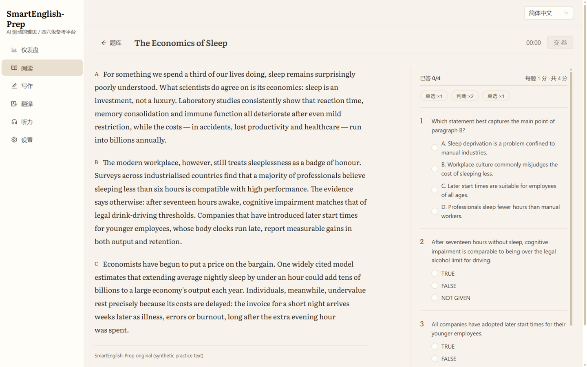
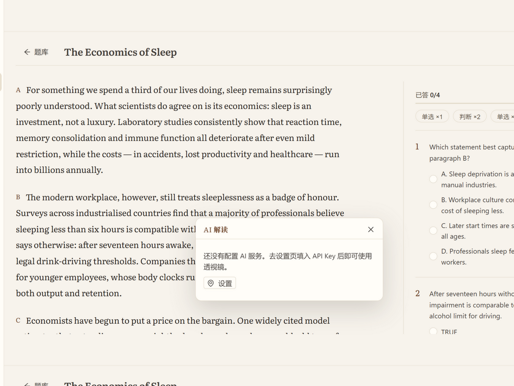
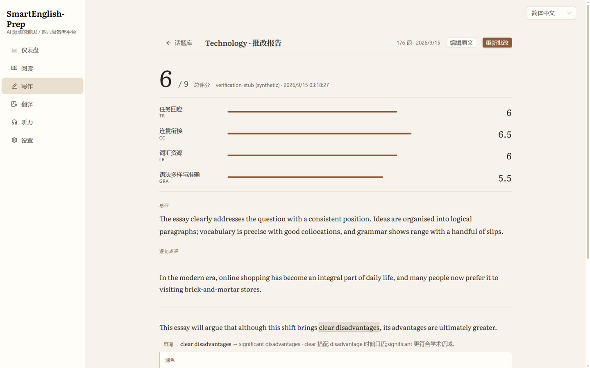
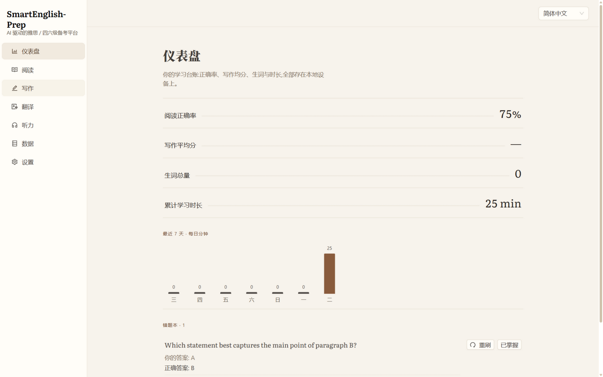
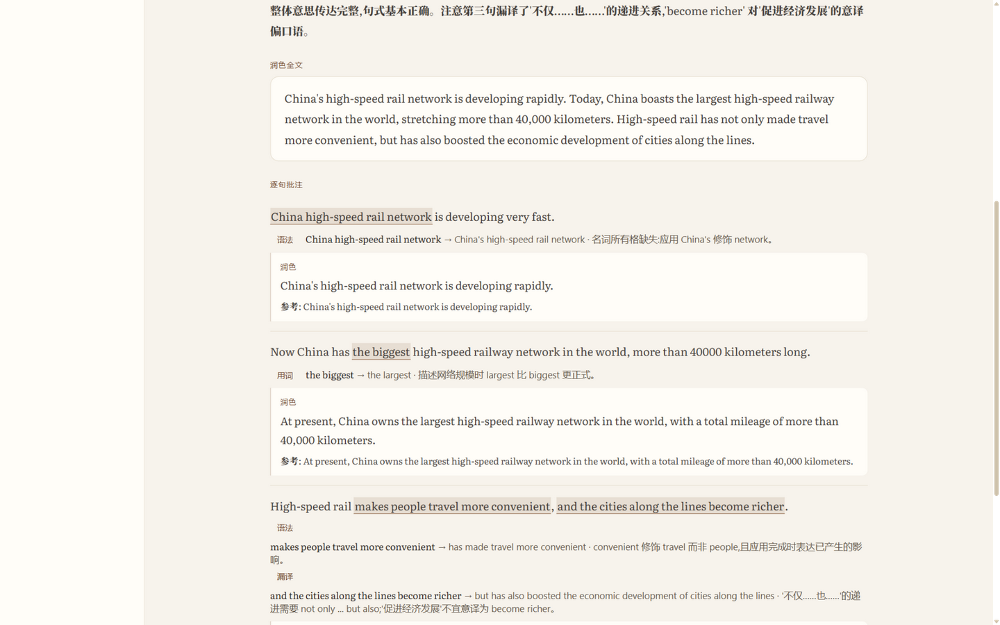
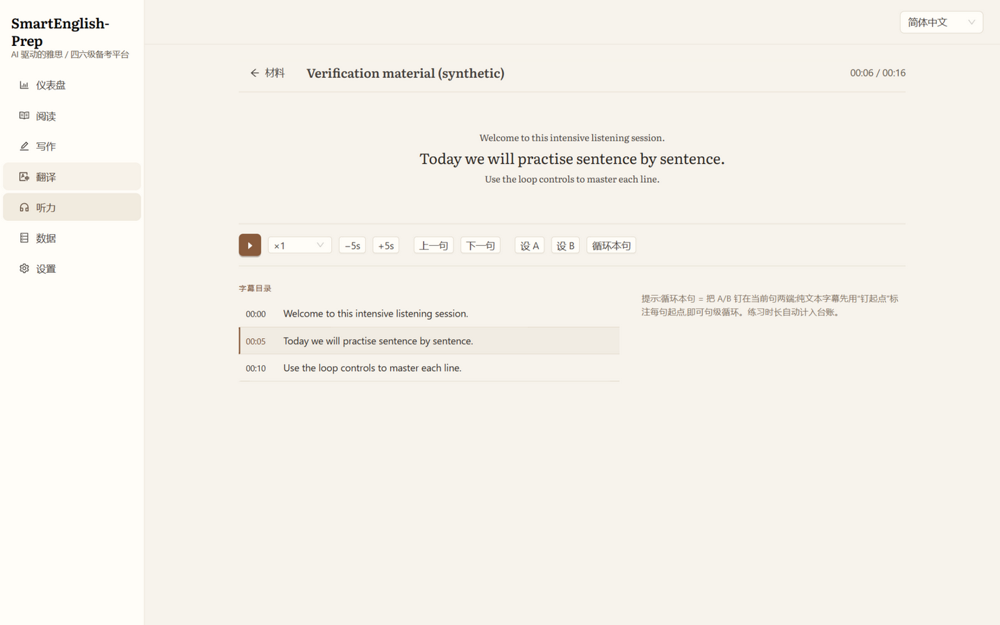
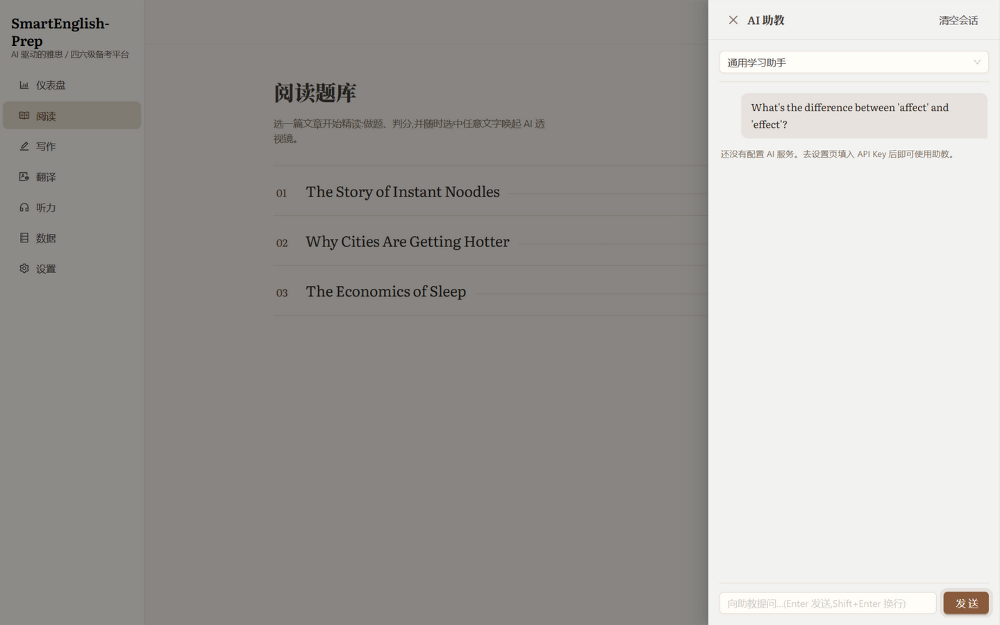

# SmartEnglish-Prep · 备考领航

<div align="left">

**AI-powered IELTS / CET-4/6 prep platform · AI 驱动的雅思与四六级备考平台**

Local-first · Works in browser & on Android (APK) · Bring your own LLM key · MIT

[](https://github.com/yu788587-dot/SmartEnglish-Prep/actions/workflows/ci.yml)
[](https://github.com/yu788587-dot/SmartEnglish-Prep/releases)

</div>

---

## ✨ Features / 功能

| Module / 模块 | Description / 说明 |
| --- | --- |
| Reading 阅读 | 题型练习(单选/判断/匹配)+ **阅读透视镜**:选中单词/长句即得 AI 释义、语法拆解、翻译,一键存生词本 |
| Writing 写作 | AI 批改:雅思 TR/CC/LR/GRA 四维评分,CET 档位制;逐句问题高亮、润色对照、词汇升级,支持重批 |
| Data 数据管理 | 学习台账(正确率/写作均分/生词/时长 + 7 日条带)、错题本(重刷/销账);JSON 备份(带校验、事务写入)+ xlsx 报表导入导出 |
| Translation 翻译 | CET 风格中译英段落:AI 逐句偏差批注(误译/漏译/增译/语法/用词/语体)、润色全文、参考译文对照 |
| Listening 听力 | 精听工整页:当前句大字三 tier、倍速 ×0.5–2、±5s、**A/B 循环与句级循环**、SRT/纯文本字幕、钉起点 |
| AI Tutor 助教 | 全局问询条:场景感知(阅读=词典、写作=考官),内置严厉雅思考官/鼓励型四六级老师角色 + 自定义角色,流式回答 |

## 📸 Screenshots / 截图

| | |
| --- | --- |
|  |  |
|  |  |
|  |  |
|  |  |

## 📱 Android APK

从 [Releases](https://github.com/yu788587-dot/SmartEnglish-Prep/releases) 下载最新 APK 安装(允许"未知来源应用"后打开)。数据全部保存在设备本地;音频等大文件仅存本机,建议定期用「数据」页导出 JSON 备份。

自建 APK:

```bash
cd frontend && npm ci && npm run build && npx cap sync android
cd android && ./gradlew assembleDebug
# android/app/build/outputs/apk/debug/app-debug.apk
```

## 🏗 Architecture / 架构

**Local-first 本地优先**:练习数据存浏览器 IndexedDB(手机端为 WebView 存储),AI 调用直连 OpenAI 兼容接口(DeepSeek / SiliconFlow / Qwen / Kimi / Ollama…),无需服务器即可完整使用。

FastAPI 后端为**可选增强服务**:AI 代理(服务器持有 key)、题库管理、服务端导入导出(pandas)。前端设置页可切换「本地直连 / 服务器代理」,服务器不可达时自动回落本地。

```
frontend/   React 18 + TypeScript + Vite + Ant Design 5 + Dexie + Zustand (+ Capacitor android/)
backend/    FastAPI + SQLAlchemy + pandas (optional / 可选)
```

## 🚀 Quick Start / 快速开始

```bash
# Frontend 前端
cd frontend
npm install
npm run dev

# Backend 后端(可选 / optional)
cd backend
python -m venv .venv
.venv\Scripts\activate        # Windows
pip install -r requirements.txt
uvicorn app.main:app --reload
```

在应用内 **设置页** 填入你的 API Key(base_url + key + model,支持任意 OpenAI 兼容服务;DeepSeek / SiliconFlow 一键预设)。

## 📖 Project / 项目

- 里程碑计划(M0–M8)与架构决策:[docs/执行计划.md](docs/执行计划.md)
- 产品事实:[PRODUCT.md](PRODUCT.md) · 设计系统:[DESIGN.md](DESIGN.md)

## ⚖️ License / 许可

[MIT](LICENSE)。仓库内置题库均为自创/公开许可材料;请勿向本仓库提交受版权保护的真题原文。

---

> 界面语言:简体中文 / English 可在应用内切换。
