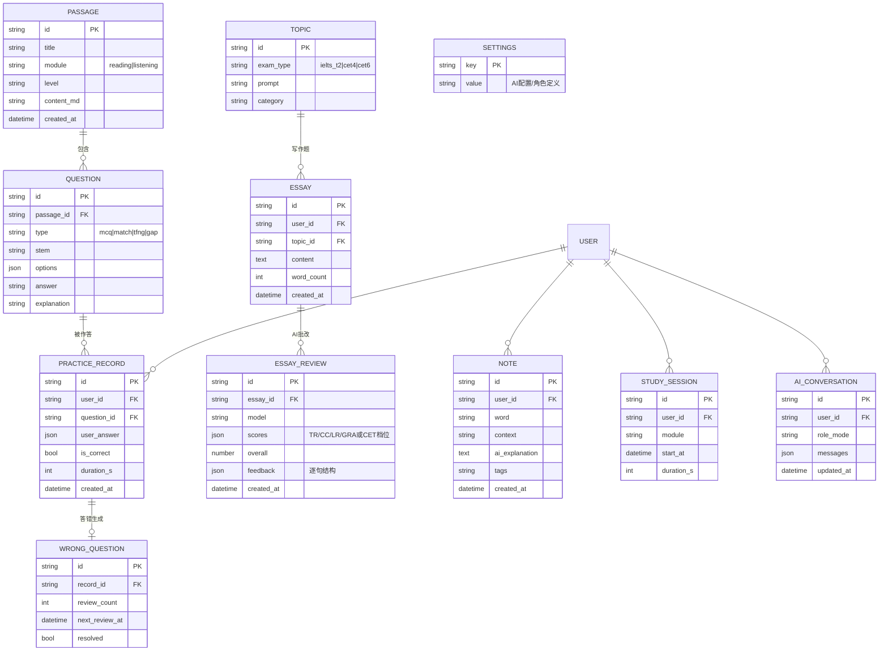

# SmartEnglish-Prep 执行计划方案

> 个人自用的 AI 雅思/CET-4/6 备考平台:浏览器可用、可打包 APK 手机使用、开源到 GitHub。
> 技术栈:React + FastAPI(2026-09 确认)

---

## 1. 相对原始想法的优化点

原需求文档方向正确,但按"个人自用 + 手机 APK + 开源"三个新约束做了以下调整:

| # | 优化项 | 原方案 | 优化后 | 理由 |
|---|--------|--------|--------|------|
| 1 | **架构:本地优先** | 所有功能依赖后端 API | 练习、数据存储、AI 调用全部在前端完成(IndexedDB 本地库 + 直连 AI API);FastAPI 后端作为**可选增强服务** | 手机 APK 不依赖电脑开机;后端仅用于 AI 代理、题库管理、桌面模式 |
| 2 | **听力后置** | 四模块并列开发 | 听力放 M5,先做字幕对照,自动转写(ASR)作为可选项 | 音频播放器/精听/转写是复杂度最高的模块,不应阻塞 MVP |
| 3 | **AI 输出强约束** | 要求 AI 返回 JSON | 统一 JSON Schema + `response_format: json_object` + Zod 校验 + 失败重试一次后降级为纯文本展示 | 防止模型偶发输出不规范导致前端渲染崩溃 |
| 4 | **导入导出双格式** | xlsx 或 json | **JSON 为机器权威格式**(带 `schemaVersion` 字段),**xlsx 为人读格式**;导入一律"先校验、后写入" | JSON 易校验、向后兼容;xlsx 方便人查看;两者内容同构 |
| 5 | **单用户但预留多用户** | 未提及 | 所有数据表带 `user_id` 外键(默认值 `local`),设置页即账户抽象 | 未来升级多用户平台只加登录,不改表结构 |
| 6 | **开源合规** | 未提及 | 内置题库只放**自创/公开许可材料**,真题原文不进仓库;MIT License + CI 从 M0 就建 | 开源仓库携带真题有版权风险;工程化惯例后期补成本高 |
| 7 | **MVP 收紧** | 四模块 + 助教一起做 | M1 只做"阅读 + AI 透视镜",先跑通 练习 → AI 反馈 → 数据留存 闭环 | 最快见到可用产品,后续模块复用同一套骨架 |

---

## 2. 总体架构

```
┌─────────────────────────────────────────────────────┐
│  手机 APK(Capacitor)  /  桌面浏览器(PWA 可装)      │
│  ┌───────────────────────────────────────────────┐  │
│  │  React 18 + TypeScript + Vite + Ant Design 5  │  │
│  │  ├─ modules/  阅读·写作·翻译·听力·仪表盘       │  │
│  │  ├─ db/       Dexie(IndexedDB)/Capacitor SQLite│ │
│  │  ├─ schemas/  Zod:AI 输出、导入导出文件格式     │  │
│  │  └─ api/      AI 直连客户端 ⇄ 服务端客户端(可切换)│ │
│  └───────────────────────────────────────────────┘  │
│        │ 直连(OpenAI 兼容协议)      │ 可选          │
│        ▼                            ▼               │
│  DeepSeek / Qwen / Kimi /   FastAPI 增强服务        │
│  Ollama(局域网)            ├─ AI 代理(藏 key)    │
│                             ├─ 题库管理 API         │
│                             └─ pandas 服务端导出    │
└─────────────────────────────────────────────────────┘
```

**技术选型**

| 层 | 选型 | 说明 |
|----|------|------|
| 前端 | React 18 + TS + Vite + Ant Design 5 | 组件库齐全,表单/表格/上传开箱即用 |
| 状态 | Zustand | 轻量;练习状态与 UI 状态分离 |
| 本地库 | Dexie.js(IndexedDB);APK 内切 Capacitor SQLite | 存储层做 adapter 抽象,Web/Native 同一套 API |
| AI 接入 | OpenAI 兼容协议直连,可配 `base_url / api_key / model` | DeepSeek、通义 DashScope、Kimi、Ollama 全覆盖 |
| 校验 | Zod(前端)/ Pydantic(后端) | AI 输出与导入文件的双重防线 |
| 后端 | FastAPI + SQLAlchemy + SQLite + pandas | 增强服务,与前端共享同一套数据格式 |
| 移动端 | Capacitor | 同一份 React 代码打包 APK |
| Excel | SheetJS(前端)/ pandas(后端) | 双端一致的 xlsx 生成 |

---

## 3. 数据模型(ER 图)



> `USER` 表物理上仅一条记录(`id='local'`),仅为多用户扩展预留。

---

## 4. 项目目录结构

```
SmartEnglish-Prep/
├── frontend/                     # React SPA(Web 与 APK 共用)
│   ├── src/
│   │   ├── api/                  # aiClient(直连)、serverClient(FastAPI)、模式切换
│   │   ├── modules/
│   │   │   ├── reading/          # 文章页、题型组件、透视镜
│   │   │   ├── writing/          # 编辑器、批改报告页
│   │   │   ├── translation/
│   │   │   ├── listening/        # 播放器、精听、字幕对照
│   │   │   ├── tutor/            # 全局 AI 助教侧边栏
│   │   │   └── dashboard/        # 时长/正确率统计
│   │   ├── components/           # 高亮渲染器、题型引擎、上传导入等通用件
│   │   ├── db/                   # Dexie 表定义、迁移、存储 adapter
│   │   ├── schemas/              # Zod:批改报告、导入导出文件、AI 配置
│   │   ├── stores/               # Zustand
│   │   └── utils/
│   ├── capacitor.config.ts
│   └── package.json
├── backend/                      # FastAPI 增强服务(可选部署)
│   ├── app/
│   │   ├── api/                  # /api/ai  /api/questions  /api/data(导入导出)  /api/stats
│   │   ├── models/               # SQLAlchemy(与前端 ER 同构)
│   │   ├── services/             # llm.py、grading.py、excel_io.py
│   │   └── prompts/              # YAML Prompt 模板(批改/助教/角色)
│   ├── tests/
│   └── pyproject.toml
├── docs/                         # 设计文档、ER 图、截图
├── seeds/                        # 内置题库(自创/公开许可材料)
├── .github/workflows/ci.yml      # lint + test + build
├── LICENSE                       # MIT
└── README.md                     # 中英双语
```

---

## 5. 分阶段执行计划

> 预计总时长约 3–4 周业余时间;每阶段结束都有可运行、可演示的产物。

### M0 项目初始化(0.5 天)
- 建 GitHub 仓库:MIT License、.gitignore、README 骨架、CI(lint + build)
- 前后端脚手架:Vite + React + TS + AntD;FastAPI + SQLAlchemy
- Dexie 全部表结构按第 3 节 ER 落地(含迁移机制)
- **验收**:`npm run dev` 与 `uvicorn app.main:app` 均能启动;CI 绿

### M1 阅读模块 + AI 透视镜 —— MVP(3–5 天)
- AI 配置页(base_url / key / model / 连通性测试)
- AI 客户端:OpenAI 兼容、流式输出、JSON mode、Zod 校验 + 重试降级
- 阅读:seeds 内置 3–5 篇文章与题目(mcq / tfng / 段落匹配),作答与判分
- **透视镜**:选中单词/长句 → AI 解释、翻译、语法拆解,浮层展示;一键存生词本
- **验收**:完整走通 读文章 → 做题 → 判分 → 选词查询 → 生词入库

### M2 写作批改 —— 核心亮点(3–4 天)
- 话题库(雅思 T2 / CET-4/6 各若干,自创题)
- 作文编辑器(字数统计、自动保存)
- 批改流水线:雅思按 TR/CC/LR/GRA 四维 rubric,CET 按档位制;Prompt 模板放 `prompts/`,输出 JSON(见 6.1)
- 批改报告页:总分 + 四维分 + 逐句对照高亮(原文/问题/润色)+ 词汇升级建议
- 批改历史与重新批改
- **验收**:提交一篇作文 → 得到结构化报告,刷新后历史可查

### M3 数据管理与导入导出 —— 核心诉求(2–3 天)
- 错题本(自动收集、重刷标记)、学习时长自动记录
- 仪表盘:各模块正确率、每日时长、生词量趋势
- 导出:JSON(权威,含 `schemaVersion`)+ xlsx(人读);前端 SheetJS
- 导入:Zod 全量校验 → 冲突策略(跳过/覆盖)→ 失败时输出逐条错误报告,不写入半截数据(事务)
- **验收**:导出 → 清空数据 → 导入 → 数据完整还原;损坏文件导入被拒绝并给出原因

### M4 翻译练习(2 天)
- 中英对照练习页、参考译文对照
- AI 偏差反馈:逐句 diff 高亮 + 表达优化建议(JSON 结构化)
- **验收**:完成一次翻译并获得高亮反馈

### M5 听力(3–5 天)
- 音频(本地文件/URL)播放器:倍速、AB 循环、逐句精听
- 字幕对照(支持 SRT/文本);关键句定位
- 可选进阶:sherpa-onnx 本地转写(移动端)或云端 ASR
- **验收**:导入音频+字幕,完成一次精听并记录

### M6 AI 助教 + 角色系统(2 天)
- 全局侧边栏助教,场景感知(阅读页=词典/语法,写作页=考官)
- 内置角色(严厉雅思考官 / 鼓励型四六级老师)+ 自定义角色(system prompt 模板)
- **验收**:三个场景下助教回复风格与角色设定一致

### M7 FastAPI 增强服务(2–3 天)
- `/api/ai` 代理(key 不进前端,适合桌面公开使用)
- 题库管理 API(批量导入题库)、`/api/export-data`、`/api/import-data`(pandas)
- 前端设置页增加"本地模式 / 服务器模式"切换
- **验收**:切到服务器模式后全功能可用;断开后端自动回退本地模式

### M8 APK 打包与开源发布(2–3 天)
- Capacitor:图标/启动屏、Capacitor SQLite adapter、Secure Storage 存 key
- 真机测试:练习/AI/导入导出全流程
- 开源准备:README(截图 + GIF + 快速开始)、演示数据、v1.0.0 tag + GitHub Release
- **验收**:手机安装 APK 完成一次完整学习流程;GitHub 仓库结构规范

---

## 6. 关键技术方案

### 6.1 写作批改 JSON Schema(节选)

```json
{
  "overall": 6.5,
  "scores": { "TR": 6.0, "CC": 6.5, "LR": 6.5, "GRA": 6.0 },
  "summary": "整体评语……",
  "sentences": [
    {
      "index": 1,
      "original": "原句……",
      "issues": [
        { "type": "grammar|collocation|logic", "excerpt": "片段",
          "suggestion": "修改", "explanation": "原因" }
      ],
      "polished": "润色后"
    }
  ],
  "vocabulary_upgrades": [ { "from": "good", "to": "beneficial" } ]
}
```

流程:AI(`response_format: json_object`)→ Zod 解析 → 失败重试 1 次 → 仍失败则以纯文本 + 警示条展示,不崩溃。

### 6.2 导出文件格式

```json
{
  "app": "SmartEnglish-Prep",
  "schemaVersion": 1,
  "exportedAt": "2026-09-15T10:00:00Z",
  "data": {
    "notes": [], "practiceRecords": [], "wrongQuestions": [],
    "essays": [], "essayReviews": [], "studySessions": [], "settings": []
  }
}
```

导入校验:`app` 与 `schemaVersion` 匹配 → 每条记录 Zod 校验 → 全部通过后单事务写入 → 任何失败则整体回滚并报告行号与原因。

### 6.3 Prompt 管理

所有 Prompt 以 YAML 存 `prompts/`,变量化(角色语气、考试类型、评分标准),前后端共用同一套模板文本,避免两边各写一份导致行为不一致。

---

## 7. 参考开源项目

| 项目 | 借鉴点 |
|------|--------|
| [ZuodaoTech/everyone-can-use-english](https://github.com/ZuodaoTech/everyone-can-use-english)(Enjoy,33.5k★) | 精听/跟读交互、桌面+多端形态 |
| [hung20gg/ielts_w2](https://github.com/hung20gg/ielts_w2) | LLM 雅思批改的 Prompt 设计 |
| [Examor](https://github.com/molaeng/Examor) | 笔记/进度打包导出机制 |
| [Open WebUI](https://github.com/open-webui/open-webui) | 现代化 AI 对话交互 |
| [Dify](https://github.com/langgenius/dify) | 模型接入抽象、Prompt 工程化 |
| [sherpa-onnx](https://github.com/k2-fsa/sherpa-onnx) | Android 端本地语音识别(听力转写) |
| [knowledgefxg/learning-english](https://github.com/knowledgefxg/learning-english)、[cet-skill](https://github.com/Liuxiangjian-ai/cet-skill) | 题源组织、真题结构分析 |

---

## 8. 风险与对策

| 风险 | 对策 |
|------|------|
| 浏览器直连 AI 遇 CORS 拦截(部分国内中转) | 优先选 CORS 友好渠道(DeepSeek 官方可用);M7 的 FastAPI 代理作兜底 |
| 模型 JSON 输出偶发不规范 | json_object 强制 + Zod 校验 + 重试一次 + 纯文本降级 |
| 真题版权 | 仓库只放自创/公开材料,真题由用户本地导入使用,不进开源仓库 |
| ASR 成本与复杂度 | M5 先做字幕文件对照,自动转写作为可选开关 |
| APK 内 http 明文请求被拒 | 全链路 https;Ollama 局域网场景在文档中说明配置方式 |
| 个人项目烂尾 | 每阶段有独立验收产物,任意时刻停下都是可用版本 |

---

## 9. 下一步

确认本计划后,从 **M0(项目初始化)** 开始执行;每完成一个里程碑同步进度与演示截图。
